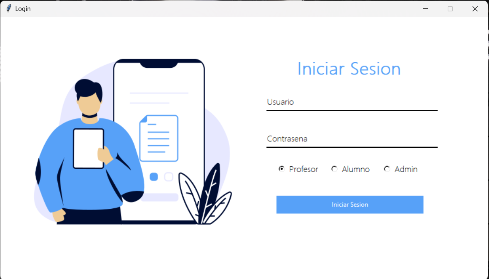
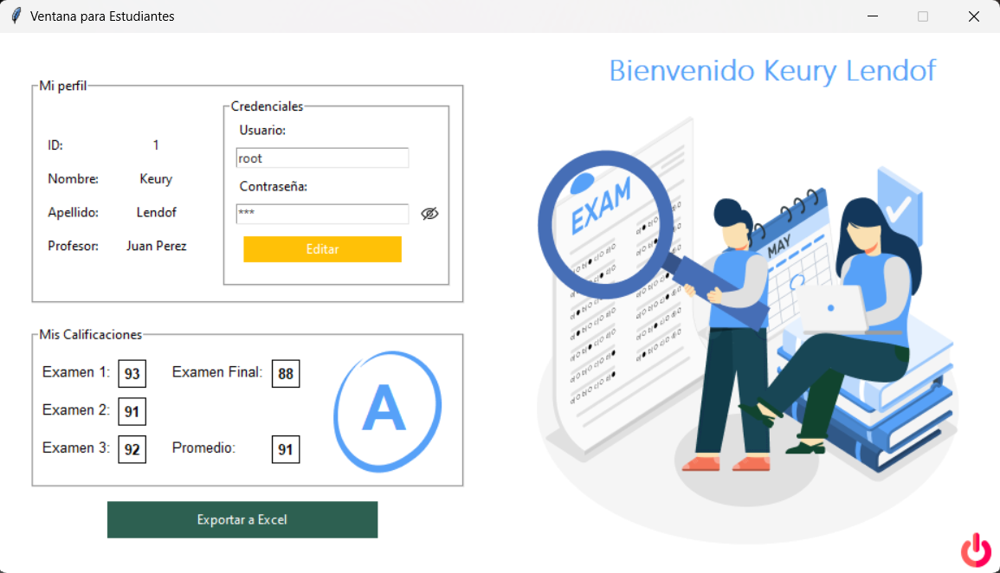
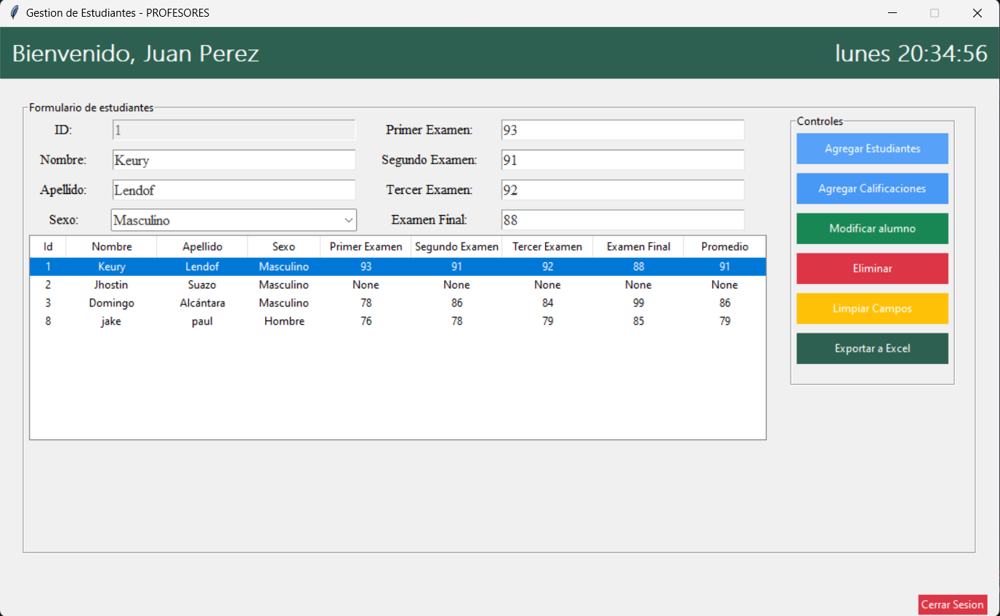
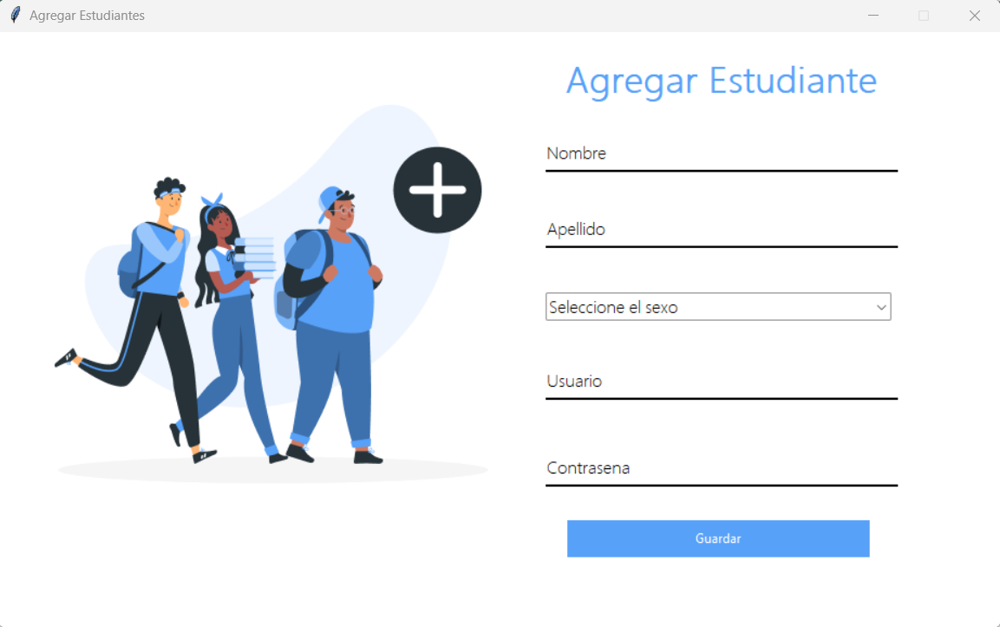
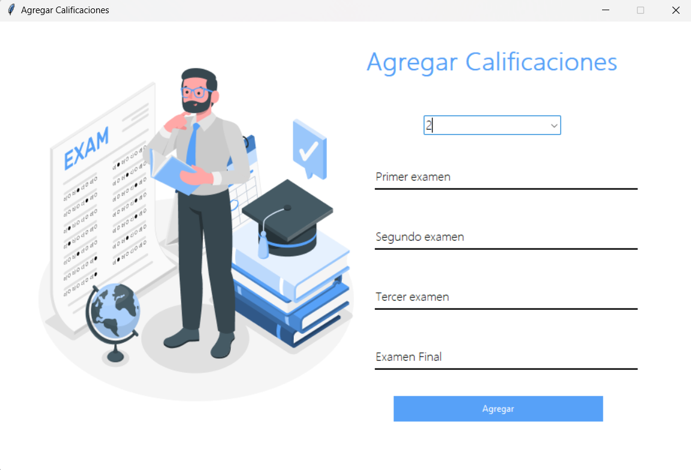
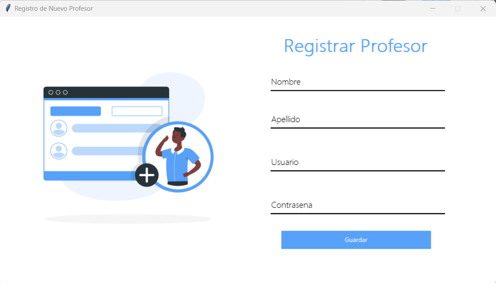

# Sistema de Gestión Académica (Proyecto Samsung)

Este es un sistema de gestión académica diseñado para brindar a profesores y estudiantes una plataforma eficiente para administrar y acceder a la información relacionada con sus cursos y calificaciones. El sistema ofrece una interfaz gráfica intuitiva y fácil de usar que permite a los usuarios realizar diversas acciones de manera sencilla.

## Características

- Registro y autenticación de profesores y estudiantes.
- Asignación de estudiantes a profesores.
- Registro y actualización de calificaciones.
- Exportación de datos a Excel.

## Interfaz Gráfica

A continuación, se muestra una guía visual de la interfaz gráfica de la aplicación:

### Pantalla de Inicio de Sesión

### Panel del Estudiante

### Panel del Profesor

### Panel de Administradores

## Requisitos

- Python 3.6 o superior
- Bibliotecas: tkinter, pyodbc, openpyxl

## Instalación

1. Clona este repositorio: `git clone https://github.com/jhostin360/samsung_proyect.git`
2. Ve al directorio del proyecto: `cd proyecto-samsung`
3. Instala las dependencias: `pip install -r
4. requirements.txt`

## Uso

1. Ejecuta `main.py` para iniciar la aplicación.
2. Inicia sesión como profesor o estudiante.
3. Realiza las acciones correspondientes, como gestionar estudiantes, registrar calificaciones, etc.

## Contribución

Si deseas contribuir a este proyecto, sigue estos pasos:

1. Haz un fork del repositorio.
2. Crea una rama para tu contribución: `git checkout -b mi-nueva-funcion`
3. Realiza tus cambios y haz commits: `git commit -m "Agrega nueva función"`
4. Haz un push a tu rama: `git push origin mi-nueva-funcion`
5. Crea una solicitud de extracción (pull request) en GitHub.

## Licencia

Este proyecto está bajo la Licencia MIT - consulta el archivo [LICENSE](LICENSE) para más detalles.

## Contacto

Si tienes preguntas o comentarios, no dudes en contactarme en lendofkeury@gmail.com.

Con esta aplicacion, simplificamos la administración académica y mejoramos la comunicación entre profesores y estudiantes. ¡Esperamos que encuentres esta herramienta útil y eficiente para tu entorno educativo!
